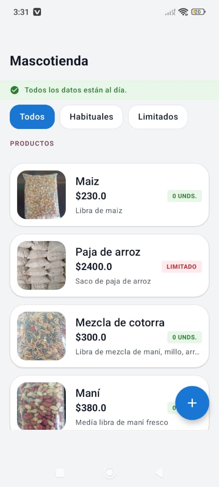

# 👋 Hi there! I'm Jorge Luis Castillo Vidal

### **Full-Stack & Mobile Software Developer | Bachelor's Degree in Computer Science**

I am a passionate software developer with over 3 years of experience designing and building scalable web and mobile solutions. I'm a Currently, Bachelor's Degree in Computer Science at **UCLV** and a Software Developer at **Club Cubano Venezolano** and **Xetid**.

🌐 **[Check out my Portfolio](https://jorgeluiscastillo.vercel.app/)**

---

## 🛠️ Tech Stack & Tools

| Category | Technologies |
| :--- | :--- |
| **Mobile** | Kotlin (Jetpack Compose), React Native (Expo)  |
| **Backend** | Java (Spring Boot), PHP (Laravel) |
| **Frontend** | React, TypeScript, JavaScript |
| **Databases** | PostgreSQL, MySQL, SQLite, Redis |
| **DevOps** | Docker, GitHub Actions, GitLab CI, Vercel, Supabase, TiDB Cloud |
| **Architecture** | Clean Architecture, Hexagonal, Microservices, MVC, MVVM, ... |

---

## 🌟 Featured Projects

### [Mascotienda](https://github.com/cjorgeluis122333/mascotienda.git)
A business-focused web application built to help a store promote and manage its products. Product information stays up to date through a **Supabase** database used by the business owners, making inventory and catalog management easier. The application is live here: **[mascotienda-mauve.vercel.app](https://mascotienda-mauve.vercel.app/)**.

> 📱 Note: This preview shows the **companion mobile app** used by the store owners to manage products, inventory and catalog updates. It is **not** the public web storefront itself. The mobile app's repository is **private** and the application is exclusively for the store owners' internal use, so it cannot be shared publicly.
>
> 

> 
<b>👁️ Click to view preview</b>

>
> 
>
> 

### [jl-particles-interactive](https://github.com/cjorgeluis122333/jl-particles-interactive.git)
A React library that makes it easy to create interactive particle-based backgrounds and animated text effects. It also includes a playground for quick testing and a package published on npm.

**Install:** `npm install jl-particle-interactive`  
**npm:** [jl-particle-interactive](https://www.npmjs.com/package/jl-particle-interactive)  
**Playground:** [jl-particles-interactive.vercel.app](https://jl-particles-interactive-l7djz9wub-jorge-luis-projects-39ec2794.vercel.app/)

### [jl-react-virtual-signature-canvas](https://github.com/cjorgeluis122333/jl-react-virtual-signature-canvas.git)
A flexible React signature-canvas library designed for virtual signing workflows. It provides fine-grained control to detect empty canvases, identify signed areas, and support more advanced signature validation and handling scenarios. The project also includes documentation and a playground.

**Install:** `npm install jl-react-virtual-signature-canvas`  
**Or:** `yarn add jl-react-virtual-signature-canvas` · `pnpm add jl-react-virtual-signature-canvas`  
**npm:** [jl-react-virtual-signature-canvas](https://www.npmjs.com/package/jl-react-virtual-signature-canvas)  
**Docs / Playground:** [jl-react-virtual-signature-canvas.vercel.app](https://jl-react-virtual-signature-canvas.vercel.app/)

---

## 📊 Experience at a Glance

* **Software Developer** @ [**DreCom LLC**](https://drecom.dev/) *(May 2026 – Jul 2026)*
* **Software Developer** @ *Club Cubano Venezolano* [(Facebook)](https://www.facebook.com/p/Circulo-Cubano-Venezolano-100054643231917) *(Jan 2026 – Present)*
* **Software Developer** @ [**Xetid**](https://www.xetid.cu/) *(2023 – Present)*

---

## 📫 Connect with me

 

> "Continuous learning is the key to innovation."

